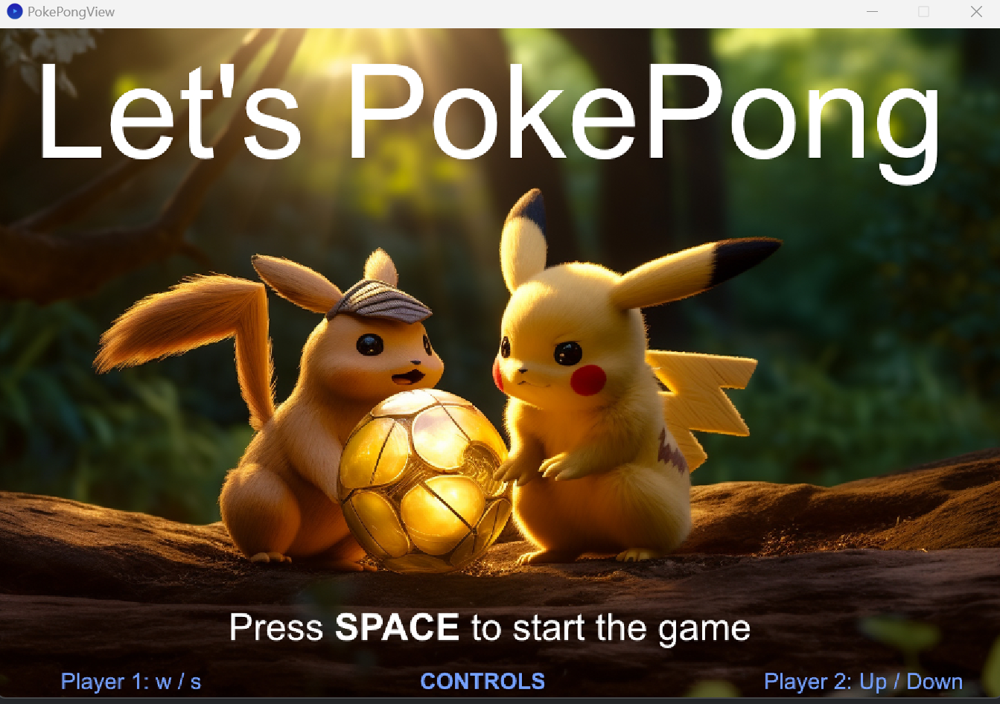
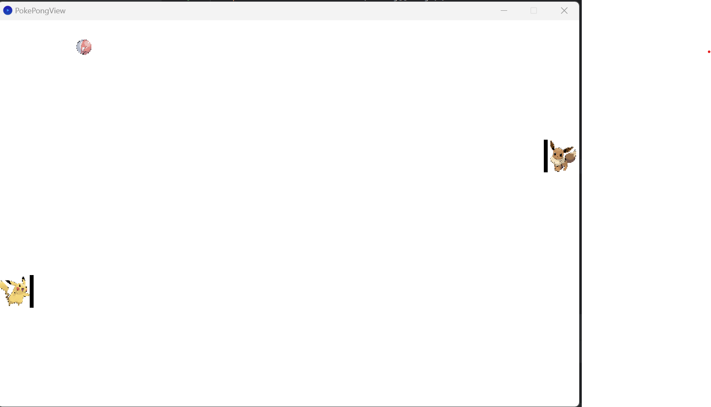
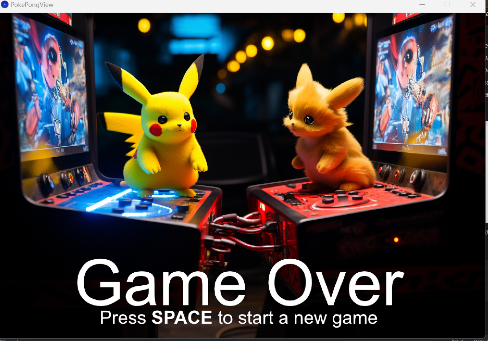

# Spielbeschreibung

Das Spiel besteht aus zwei gegeneinander antretenden Spielern.
Ein Ball bewegt sich über das Spielfeld und prallt auf den Rändern.
Die zwei Spieler sollen verhindern,dass das Ball aus der eigenen seite(link beziehungsweise recht ) hinausfliegt.

### Hier eine *kurze visuelle Beschreibung* des Spiels!

*Auf  diesem Oben eingefügten Screenshot kann man bei Player1 und Player2 die Steuerungstasten lesen ,also up/down(die nach oben zeigende Pfeiltaste und die nach unten zeigende Pfeiltaste) beziehungsweise w/s.
Mit der Leertaste kann man das Spiel starten*

 *Hier kann man einen kleinen Überblick auf das spielfeld haben.*

 *Am Ende jedes Spiels ist dieses Interfaces zu sehen,mit der Leertaste kann man mit dem Spiel wieder beginnen.*

### Hier sind *die in meinem Programm verwendeten Bibliothekslinks*
